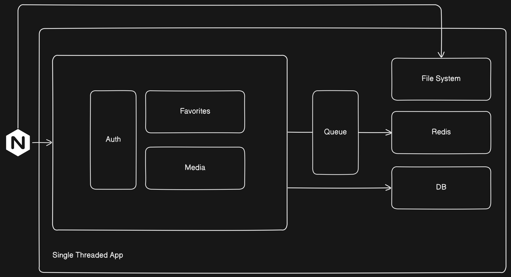

# APP

## Brief Description

A media sharing platform allows users to upload images or videos, view a list of
all images and videos, and like/unlike them.

## Simple User Stories

-   [x] As a visitor, I can sign up for an account using JWT or OAuth.
-   [x] As a user, I can log in to my account.
-   [x] As a user, I can upload an image or video.
-   [x] As a user, I can view a list of all images and videos.
-   [x] As a user, I can like/unlike an image or video.
-   [x] As a user, I can view a list of all images and videos that I have liked.
-   [x] As a user, I can delete an image or video that I have uploaded.
-   [x] As a user, I can log out of my account.
-   [x] As a user, I can reset my password.

-   [ ] As a user, I can share an image or video with other users.
-   [ ] As a user, I can delete my password.
-   [ ] As a user, I can filter images and videos by category.
-   [ ] As a user, I can search for images and videos by title.
-   [ ] As a user, I can view my storage usage.

## App Structure

The app is structured in the following way:

-   src: contains the source code of the app.
    -   config: contains the configuration files of the app.
    -   db: contains the database schema and seed data using sequelize ORM.
        -   models: contains the database models.
        -   migrations: contains the database migrations.
        -   repository: contains the database repository for database operations.
    -   middleware: contains the shared middleware functions of the app.
    -   redis: contains the redis client interface.
    -   route: contains the route handlers of the app.
    -   util: contains the shared utility functions of the app.
    -   mail: contains the mailer interface.
    -   feature: contains the feature modules of the app whereas each folder encapsulates controllers, helpers, middlewares or other necessary files.
        -   auth: contains the authentication feature module.
        -   media: contains the media feature module.
        -   like: contains the like feature module.
-   public: contains the static files and views of the app.
-   test: contains the sample http requests and responses for testing the app.
-   .env: contains the environment variables of the app.
-   copyView.js: copies the views to the public folder since typescript does not compile the views.

The use of this strcture has a certain advantage beyond organization, modularity and separation of concerns. It allows easy exploration of the app so that almost anyone can understand the app structure and make changes easily.

## General Architecture

The app is a monolithic architecture that consists of the following components:

-   API Server: serves the API endpoints.
-   Database: stores the user information, uploaded media information, and likes information.
-   Redis: stores the user sessions.
-   Nginx: reverse proxy server, load balancer, and static file server.
-   BullMQ: processes the email jobs.
-   SMTP Server: sends the email notifications.
-   Third-party Providers: provides the OAuth authentication.

## DB Schema

The database schema consists of the following tables:

-   users: contains the user information.
-   uploads: contains the uploaded media information.
-   likes: contains the likes information.

The use of this schema is to store the user information, uploaded media information, and likes information however the schema can be extended to store more information. For example, the users table can be extended with a simple modification to support extra providers for third-party authentication. This can be done through an additional table that stores the provider information and the user id.

The use of relational database simply because it is more structured and provides better performance for complex queries. The use of MySQL is because it is more popular and has better support for the ORM used in the app.

## Tech Stack

-   Node.js v20x
-   Express.js v4x
-   Sequelize v6x
-   Redis v3x
-   Nodemailer v6x
-   Typescript v4x
-   BullMQ v3x
-   MySQL DB
-   Nginx: reverse proxy server, load balancer, and static file server.
-   Swagger: API documentation.

## Installation

1.  Clone the repository.
2.  Install the dependencies using `npm install`.
3.  Create a `.env` file in the root directory following the [`env.example`](./README/env) file.
4.  Start MySQL server.
5.  Start Redis server.
6.  Run the database migrations using `npm run db:create` then `npm run db:reset`.
7.  Configure Nginx to serve the static files and reverse proxy the API server following the [`nginx.conf`](./README/nginx.conf) file. NOTE: NGINX configuration location differs based on the OS.
8.  Start NGINX server.
9.  Start the app using `npm run start`.
10. Visit `http://localhost:PORT/api/v1/docs` to view the API documentation.

## API Endpoints

For the API endpoints, visit the [`API Endpoints`](./test/http) folder.

They're structured in resource-based endpoints.

## API Documentation

The API documentation is generated using Swagger. Visit `http://localhost:PORT/api/v1/docs` to view the API documentation.

## Performance Measures

-   The use of Redis for caching the user sessions is to improve the performance of the app by reducing the number of database queries.
-   The use of BullMQ for processing the email jobs is to improve the performance of the app by offloading the email sending process to a separate worker.
-   The use of Nginx to serve the static files is to improve the performance of the app by reducing the load on the API server.
-   The app is horizontally scalable by running multiple instances of the app behind a load balancer.

## Security Measures

-   The use of JWT for authentication is to secure the app by generating a token for the user.
-   The use of OAuth for authentication is to secure the app by allowing the user to authenticate using a third-party provider.
-   The use of CORS is to secure the app by allowing only specific origins to access the app.
