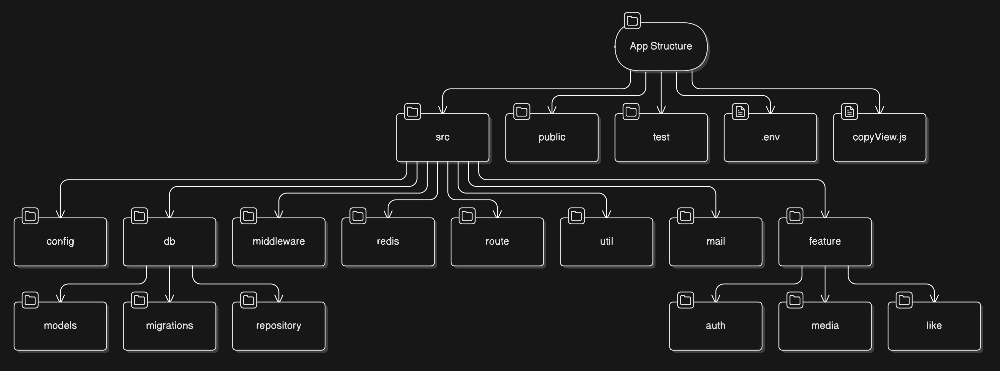
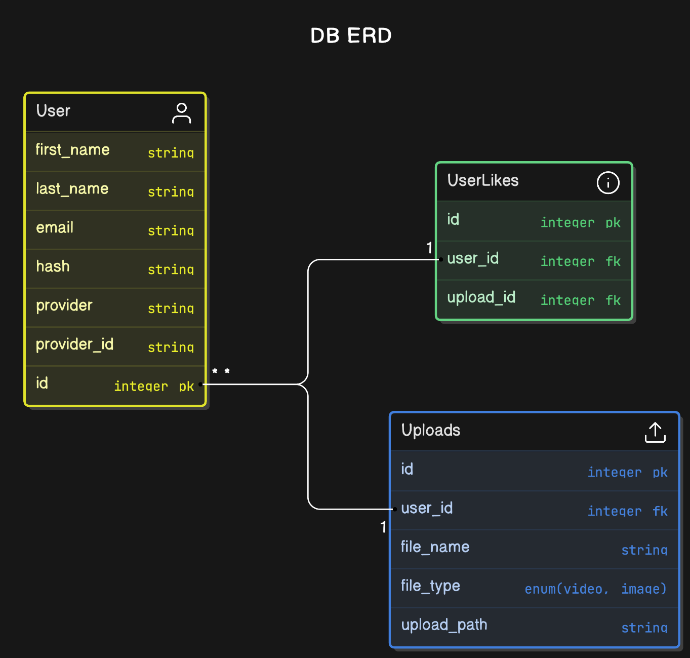

# APP

## Brief Description

A media sharing platform allows users to upload images or videos, view a list of
all images and videos, and like/unlike them.

## Simple User Stories

-   [x] As a visitor, I can sign up for an account using JWT or OAuth.
-   [x] As a user, I can log in to my account.
-   [x] As a user, I can upload an image or video.
-   [x] As a user, I can view a list of all images and videos.
-   [x] As a user, I can like/unlike an image or video.
-   [x] As a user, I can view a list of all images and videos that I have liked.
-   [x] As a user, I can delete an image or video that I have uploaded.
-   [x] As a user, I can log out of my account.
-   [x] As a user, I can reset my password.

-   [ ] As a user, I can share an image or video with other users.
-   [ ] As a user, I can delete my password.
-   [ ] As a user, I can filter images and videos by category.
-   [ ] As a user, I can search for images and videos by title.
-   [ ] As a user, I can view my storage usage.

## App Structure

The app is structured in the following way:

-   src: contains the source code of the app.
    -   config: contains the configuration files of the app.
    -   db: contains the database schema and seed data using sequelize ORM.
        -   models: contains the database models.
        -   migrations: contains the database migrations.
        -   repository: contains the database repository for database operations.
    -   middleware: contains the shared middleware functions of the app.
    -   redis: contains the redis client interface.
    -   route: contains the route handlers of the app.
    -   util: contains the shared utility functions of the app.
    -   mail: contains the mailer interface.
    -   feature: contains the feature modules of the app whereas each folder encapsulates controllers, helpers, middlewares or other necessary files.
        -   auth: contains the authentication feature module.
        -   media: contains the media feature module.
        -   like: contains the like feature module.
-   public: contains the static files and views of the app.
-   test: contains the sample http requests and responses for testing the app.
-   .env: contains the environment variables of the app.
-   copyView.js: copies the views to the public folder since typescript does not compile the views.

## DB Schema

## Tech Stack

-   Node.js v20x
-   Express.js v4x
-   Sequelize v6x
-   Redis v3x
-   Nodemailer v6x
-   Typescript v4x
-   BullMQ v3x
-   MySQL DB
-   Nginx: reverse proxy server, load balancer, and static file server.
-   Swagger: API documentation.
-

## Installation

1.  Clone the repository.
2.  Install the dependencies using `npm install`.
3.  Create a `.env` file in the root directory following the `env.example` file.
4.  Start MySQL server.
5.  Start Redis server.
6.  Run the database migrations using `npm run db:create` then `npm run db:reset`.
7.  Configure Nginx to serve the static files and reverse proxy the API server following the `nginx.conf` file. NOTE: NGINX configuration location differs based on the OS.
8.  Start NGINX server.
9.  Start the app using `npm run start`.
10. Visit `http://localhost:3000/api/v1/docs` to view the API documentation.

## API Documentation

The API documentation is generated using Swagger. Visit `http://localhost:3000/api/v1/docs` to view the API documentation.
